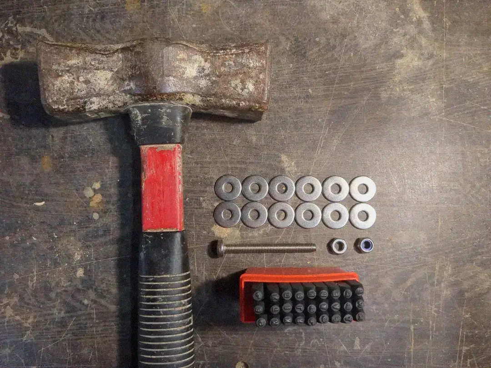
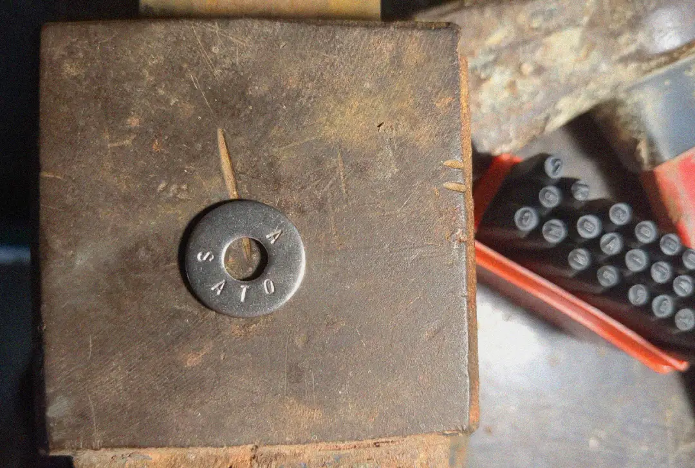
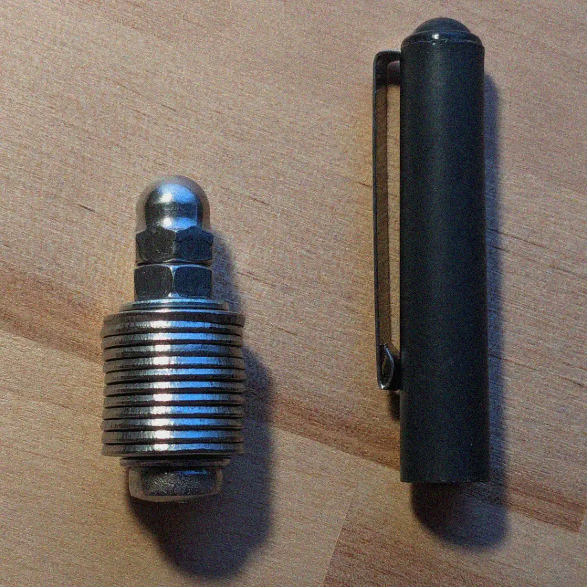

I've been thinking about how to improve my seed backup in a cheap and cool way, mostly for fun. Until now, I had the seed written on a piece of paper in a desk drawer, and I wanted something more durable and fire-proof.

[Show me the final result!](#the-final-result)

After searching online, I found two options I liked the most: the [Cryptosteel](https://cryptosteel.com/) Capsule and the [Trezor Keep](https://trezor.io/trezor-keep-metal). These products are nice but quite expensive, and I didn't want to spend that much on my seed backup. **Privacy** is also important, and sharing details like a shipping address makes me uncomfortable. This concern has grown since the Ledger incident[^1]. A $5 wrench attack[^2] seems too cheap, even if you only hold a few sats.

Upon seeing the design of Cryptosteel, I considered creating something similar at home. Although it may not be as cool as their device, it could offer almost the same in terms of robustness and durability.

## Step 1: Get the materials and tools

When choosing the materials, you will want to go with **stainless steel**. It is durable, resistant to fire, water, and corrosion, very robust, and does not rust. Also, its price point is just right; it's not the cheapest, but it's cheap for the value you get.

I went to a material store and bought:

- Two bolts
- Two hex nuts and head nuts for the bolts
- A bag of 30 washers

All items were made of stainless steel. The total price was around **€6**. This is enough for making two seed backups.

You will also need:

- A set of metal letter stamps (I bought a 2mm-size letter kit since my washers were small, 6mm in diameter)
    - You can find these in local stores or online marketplaces. The set I bought cost me €13.
- A good hammer
- A solid surface to stamp on

Total spent: **19€** for two backups

## Step 2: Stamp and store

Once you have all the materials, you can start stamping your words. There are many videos on the internet that use fancy 3D-printed tools to get the letters nicely aligned, but I went with the free-hand option. The results were pretty decent.

I only stamped the first 4 letters for each word since the BIP-39 wordlist allows for this. Because my stamping kit did not include numbers, I used alphabet letters to define the order. This way, if all the washers were to fall off, I could still reassemble the seed correctly.

## The final result

So this is the final result. I added two smaller washers as protection and also put the top washer reversed so the letters are not visible:

Compared to the Cryptosteel or the Trezor Keep, its size is much more compact. This makes for an easier-to-hide backup, in case you ever need to hide it inside your human body.

## Some ideas

### Tamper-evident seal

To enhance the security this backup, you can consider using a **tamper-evident seal**. This can be easily achieved by printing a **unique** image or using a specific day's newspaper page (just note somewhere what day it was).

Apply a thin layer of glue to the washer's surface and place the seal over it. If someone attempts to access the seed, they will be forced to destroy the seal, which will serve as an evident sign of tampering.

This simple measure will provide an additional layer of protection and allow you to quickly identify any unauthorized access attempts.

Note that this method is not resistant to outright theft. The tamper-evident seal won't stop a determined thief but it will prevent them from accessing your seed without leaving any trace.

### Redundancy

Make sure to add redundancy. Make several copies of this cheap backup, and store them in separate locations.

### Unique wordset

Another layer of security could be to implement your own custom mnemonic dictionary. However, this approach has the risk of permanently losing access to your funds if not implemented correctly.

If done properly, you could potentially end up with a highly secure backup, as no one else would be able to derive the seed phrase from it. To create your custom dictionary, assign a unique number from 1 to 2048 to a word of your choice. Maybe you could use a book, and index the first 2048 unique words that appear. Make sure to store this book and even get a couple copies of it (digitally and phisically).

This self-curated set of words will serve as your personal BIP-39 dictionary. When you need to translate between your custom dictionary and the official [BIP-39 wordlist](https://github.com/bitcoin/bips/blob/master/bip-0039/english.txt), simply use the index number to find the corresponding word in either list.

> Never write the idex or words on your computer (Do not use `Ctr+F`)

> A backed-up seed only matters if you also use crypto services safely. Read the [5 rules for safely using crypto services](/blog/stay-safe-using-services) for the other half of the picture, and browse [no-KYC services that accept Bitcoin](/?currency-mode=or&currencies=btc&max-kyc=1) when you need to acquire more.

[^1]: https://web.archive.org/web/20240326084135/https://www.ledger.com/message-ledgers-ceo-data-leak
[^2]: https://xkcd.com/538/
