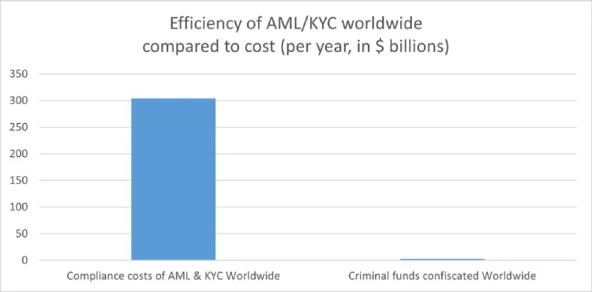

> The future is there... staring back at us. Trying to make sense of the fiction we will have become.
>
> *William Gibson*

This month is [the 4th anniversary](#the-anniversary) of kycnot.me. Thank you for being here.

Fifteen years ago, Satoshi Nakamoto introduced Bitcoin, a peer-to-peer electronic cash system: a decentralized currency **free from government and institutional control**. Nakamoto's whitepaper showed a vision for a financial system based on trustless transactions, secured by cryptography. Some time forward and KYC (Know Your Customer), AML (Anti-Money Laundering), and CTF (Counter-Terrorism Financing) regulations started to come into play.

What a paradox: to engage with a system designed for decentralization, privacy, and independence, we are forced to give away our personal details. Using Bitcoin in the economy requires revealing your identity, not just to the party you interact with, but also to third parties who must track and report the interaction. You are forced to give sensitive data to entities you don't, can't, and shouldn't trust. Information can never be kept 100% safe; there's always a risk. Information is power, who knows about you has control over you.

Information asymmetry creates imbalances of power. When entities have detailed knowledge about individuals, they can manipulate, influence, or exploit this information to their advantage. The accumulation of personal data by corporations and governments enables extensive surveillances.

Such practices, moreover, exclude individuals from traditional economic systems if their documentation doesn't meet arbitrary standards, reinforcing a dystopian divide. Small businesses are similarly burdened by the costs of implementing these regulations, hindering free market competition[^1]:

How will they keep this information safe? Why do they need my identity? Why do they force businesses to enforce such regulations? It's always for your safety, to protect you from the "bad". Your life is perpetually in danger: terrorists, money launderers, villains... so the government steps in to save us.

> ‟Hush now, baby, baby, don't you cry
> Mamma's gonna make all of your nightmares come true
> Mamma's gonna put all of her fears into you
> Mamma's gonna keep you right here, under her wing
> She won't let you fly, but she might let you sing
> Mamma's gonna keep baby cosy and warm”
>
> *Mother, Pink Floyd*

We must resist any attack on our privacy and freedom. To do this, we must collaborate.

If you have a service, refuse to ask for KYC; find a way. Accept cryptocurrencies like Bitcoin and Monero. Commit to circular economies. Remove the need to go through the FIAT system. People need fiat money to use most services, but we can change that.

If you're a user, donate to and prefer using services that accept such currencies. Encourage your friends to accept cryptocurrencies as well. Boycott FIAT system to the greatest extent you possibly can.

This may sound utopian, but it can be achieved. This movement can't be stopped. Go kick the hornet's nest.

> We must defend our own privacy if we expect to have any. We must come together and create systems which allow anonymous transactions to take place. People have been defending their own privacy for centuries with whispers, darkness, envelopes, closed doors, secret handshakes, and couriers. The technologies of the past did not allow for strong privacy, but electronic technologies do.
>
> *Eric Hughes, A Cypherpunk's Manifesto*

## The anniversary

Four years ago, I began exploring ways to use crypto without KYC. I bookmarked a few favorite services and thought sharing them to the world might be useful. That was the first version of [kycnot.me](/): a simple list of about 15 services. Since then, I've added services, rewritten it three times, and improved it to what it is now.

[kycnot.me](/) has remained 100% open source[^2] all these years. I've received offers to buy the site, all of which I have declined and will continue to decline. It has been DDoS attacked many times, but we made it through. I have also rewritten the whole site almost once per year (three times in four years).

The code and scoring algorithm are open source (contributions are welcome) and I can't arbitrarly change a service's score without adding or removing attributes, making any arbitrary alterations obvious if they were fake. You can even see [the score summary](/api/v1/service/bisq/summary) for any service's score.

I'm a one-person team, dedicating my free time to this project. I hope to keep doing so for many more years. Again, thank you for being part of this.

> The full case for why this site exists is in [KYC? No, thanks](/blog/kyc-no-thanks). For practical guides, start with the [5 rules to avoid scams and frozen funds](/blog/stay-safe-using-services), [a DIY metal seed backup for under €20](/blog/diy-seed-backup), and [the history of Monero](/blog/monero-history).

[^1]: https://x.com/freedomtech/status/1796190018588872806
[^2]: https://codeberg.org/pluja/kycnot.me
