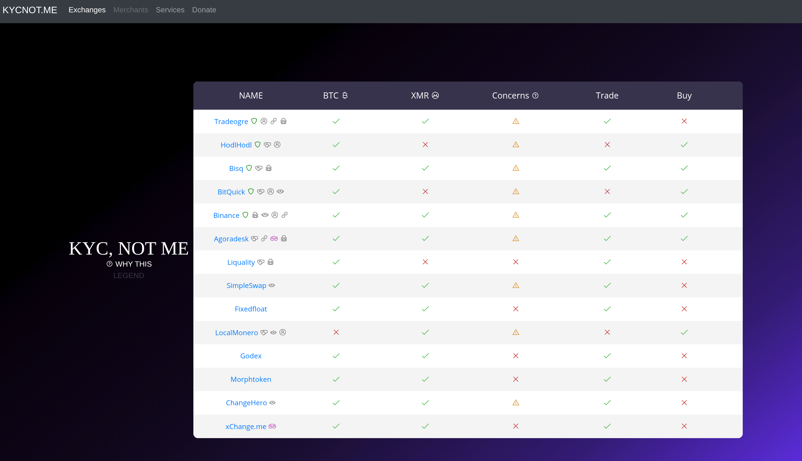
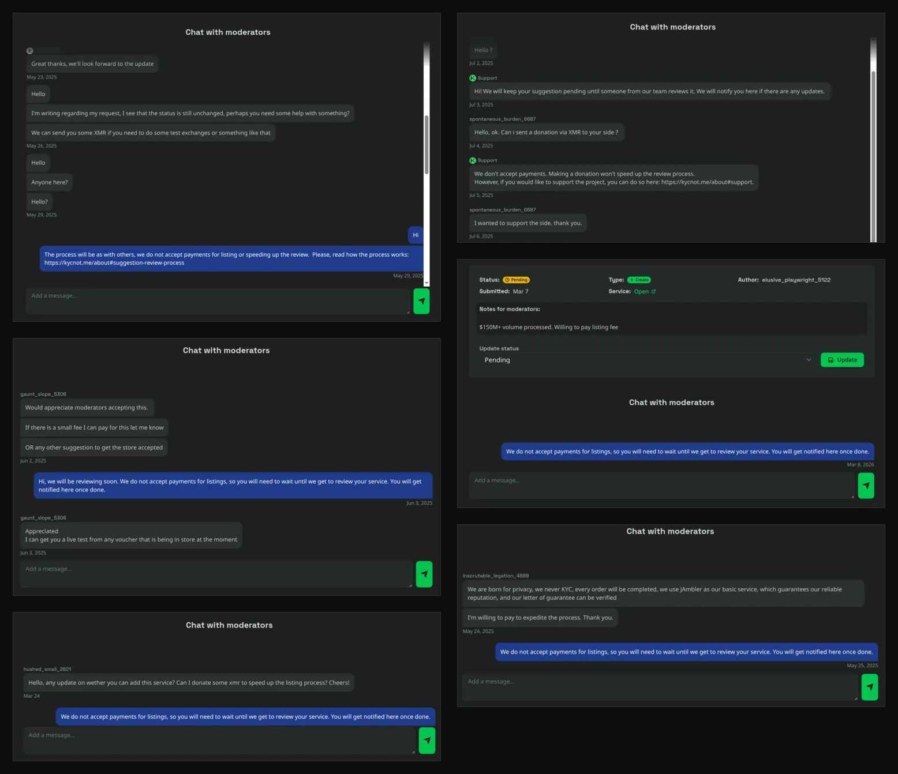
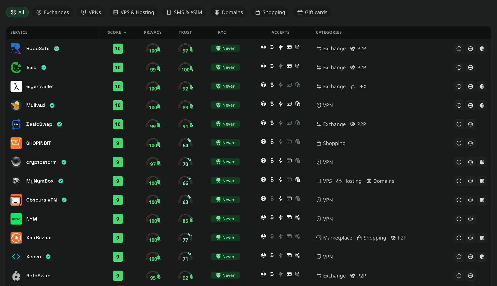

This month will be six years since I made the first commit to KYCnot.me. I started it because the exchange I was using suddenly asked me for KYC, and it felt wrong.

I didn't want to scan my ID, send a selfie, attach my financial activity to my legal identity, and hope some company would store all of that safely forever. I wanted to use cryptocurrency in the way that had made me interested in it in the first place: self-custody, direct access, fewer middlemen, and less permission.

So I started looking for alternatives, and at first I had just a small list. Around ten services, probably less, that I shared with a few friends whenever they asked where they could swap or buy without KYC. After doing that enough times, I figured it would be easier to publish the list somewhere.

That became KYCnot.me.

## How it changed

For a long time, the site was small enough that I could keep most of it in my head. I knew the services, what had changed, and which ones to watch more closely. The work was there, but it was manageable.

Then more people started using it, and the list also grew.

That was good, but it also changed the project. Once people rely on a directory, every listing matters. An outdated entry wastes someone's time. A bad recommendation sends them somewhere they shouldn't trust, and a weak standard turns the whole list into noise.

Maintaining KYCnot.me has meant reading reports, checking services again, dealing with complaints, saying no, and sometimes changing my mind when new information comes in. It has also meant accepting that there will always be things I miss. Services change their policies quietly. Some add KYC only for certain countries, amounts, coins, payment methods, or risk flags. Others are vague on purpose.

That's one of the hard parts: KYC is no longer always a yes-or-no question. Sometimes the real answer is "not usually", "not for this flow", or "not until they decide your account looks suspicious." I don't like that ambiguity, but ignoring it would be dishonest.

## Independence matters

Over the years, services have offered money to be listed, promoted, or scored higher. Some are blunt about it; you can see a few below.

Refusing is the minimum requirement for the project to mean anything. If a directory about no-KYC services can be bought, it becomes advertising with a search box. Users would have no reason to trust it, and I would have no reason to keep working on it.

KYCnot.me has to stay independent. Listings, scores, and placement are not for sale. The code is open source, and a score isn't something I set by hand: it comes from the attributes on each service, and those attributes are public on the service's page. The only way I could move a score would be to add a fake or misleading attribute, and everyone would see it. Within a score range, the order is random.

This also means I make decisions that services don't like. Some get angry when their service is rejected. Others argue a small KYC requirement shouldn't count, or insist they deserve a better score for being "privacy focused" while still asking for personal information where it matters.

People ask how this is funded. There are no sponsors, and nothing on the site is for sale: you cannot pay to be listed, to rank higher, to get a better score, or to skip the queue on a review. The only money the site itself makes comes from referral links on some services, and even that is recent. I added them about a year ago; for the first five years there were none. A referral link earns a small commission if you use it, but it never changes a service's score or where it appears. Everything else is donations.

If you want to help the project, you can [support it with a donation](https://kycnot.me/about#donate).

## The human side of it

For the first five years, KYCnot.me was just me.

For a while that was fine. The project kept growing, though, and so did the amount of time it needed. I have a personal life, work, bad days, and weeks where I don't want to look at another exchange policy page. Pretending otherwise would be silly.

A friend now helps me from time to time with messages and comment moderation, and I am trying to get more people to collaborate on moderation and event tracking. That has made things lighter, and I'm grateful for it. The main decisions are still mine, though.

I care about this project more than I expected to.

Part of that is because it started from a real frustration. Part of it is because people use it for real decisions. Some are just looking for a quick swap. Others live in places where financial surveillance, frozen accounts, or broken banking systems are not abstract problems. For them, privacy is a requirement.

KYCnot.me is a small project, but it sits near something much bigger: the right to transact without being forced to identify yourself. And that right keeps shrinking.

## The future

When I started KYCnot.me, as far as I know it was the first directory of its kind. More are appearing now. Some are built with good intentions; others are spun up fast because AI makes it easy to generate pages, scrape information, and publish something that looks complete.

I don't think more directories are bad by default. More people caring about privacy is good. More public pressure against mandatory KYC is good. If another project does honest work and helps users avoid invasive services, I'm happy it exists.

But trust takes time.

A directory can look full on day one. It cannot have a reputation on day one. Reputation comes from the boring parts: fixing mistakes, refusing money, removing services when they get worse, keeping standards even when it costs you, and being clear about what you know and what you don't.

That is where I want KYCnot.me to stay focused.

I don't want it to become a content farm or chase every trend. I want the site to remain useful, strict, and independent, even if that means it grows more slowly.

There are always things to improve: clearer criteria, reports that are easier to handle, listings that explain edge cases better, more honesty about uncertainty without becoming unreadable. I don't want to promise a giant rebuild here, because promises are cheap and time is not, but I do want the project to keep getting better in the ways that matter.

## Six years later

When I made the first version of KYCnot.me, I only wanted a place to put a list.

Six years later, it has become one of the projects I feel most attached to. It isn't perfect, and it doesn't solve the privacy problem. What it does is give people a starting point when they decide they don't want to hand over their identity for every financial action they take.

Thank you to everyone who has used the site, sent reports, opened issues, corrected mistakes, suggested services, challenged a listing, or told someone else about the project. KYCnot.me is better because people care enough to point out when something is wrong.

I'm also grateful for the people I met along the way, in person (Monerokon, Meetups...) and online.

Always remember: Don't get KYC'ed!

## Anniversary Update

I also shipped a few things to mark the anniversary:

### Table view

This new view is available on the list. Select it and you will see an easy-to-compare table. Just to bring back the old table UI from the first KYCnot.me versions, and for easier comparisons. You will find a button to enable it on the homepage.

### Scam / Issues report and events

Being alone on this, it's hard to keep up with everything that moves in this space. For this, some users I trust will be contributing to this specific area of the site. I need users that are usually online, and can be aware of issues fast.

You will see improvements on this over the next weeks. This is just in beta testing now, but users will be able to report personal issues with a service (scam, funds blocked, etc). Clear and verifiable evidence will be required. Involved users and services will be able to participate in the conversation, and the issue will be tracked. This may put some pressure on services to move things faster, and make other users aware of the issues.

### Contact form now has a chat

You may have noticed I removed all forms of direct contact outside the website. The reason for this was abuse; every solution I tried led to abuse. Now this direct contact will be much more strict.

Users can now contact directly from the contact form and follow the conversation on the platform in a chat-like fashion. Once a conversation is resolved, it is automatically deleted after 30 days.

### Other changes

- KYC level on cards is now a badge: Never, Unstated, Rare, Shotgun and Mandatory.
- New table view so services are easier to compare.
- An approved order ID now reads "Order ID checked" instead of "verified customer", because checking an order ID is not the same as vouching for a whole review.
- Forms should now keep what you typed if a submission fails, so you don't lose your text.
- Security and privacy improvements and some bug fixes.
- Minor UI/UX improvements.
- Some new contributors joined to help maintain the site more up-to-date with ongoing events, as mentioned before.
