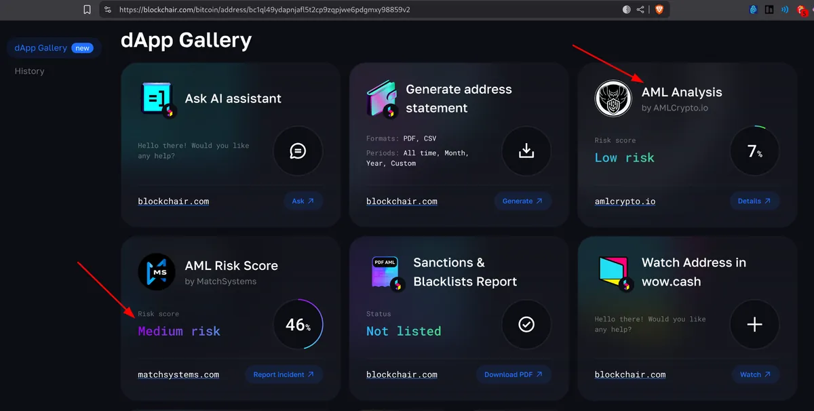

> [Jump straight to the rules](#the-rules)

Getting services and paying with cryptocurrencies comes with **some risks that every user must understand**. However, there are some **simple steps you can take to reduce them**.

## The risks

### Transactions are Irreversible

**Cryptocurrency transactions are final and irreversible**. Once you hit send, **there's no chargeback option**, no bank to call, and no dispute resolution (unless the recipient voluntarily returns your funds). This creates opportunities for bad actors to exploit.

---

### Shotgun KYC

One of the most predatory practices in the crypto space is **Shotgun KYC** (classified as a [warning attribute](/attributes) here on KYCnot.me). Here's how it typically unfolds:

1. **You send** your cryptocurrency to a service
2. After receiving your funds, **they suddenly claim your coins are "dirty"** or flagged
3. **They hold your funds hostage**, demanding extensive documentation
4. Even after compliance, they may continue requesting more information indefinitely **until you can't no longer provide what they are requesting**
5. **Your funds remain frozen** with no guarantee of release

---

### Transaction Scanning

Most crypto services use **blockchain analysis** to scan your coins' transaction history, assigning **risk scores based on past associations**. A low score doesn't mean you did anything wrong, you could have unknowingly received "tainted" coins from a simple P2P trade, **inheriting a history that wasn't your fault**.

---

### Other Concerns

- **Limited Support**: Many services operate with very **small teams or even just a single person**, offering minimal customer service. Even established services may ignore customer complaints or disputes.
- **Exit Scams**: A service that was apparently trustworthy and processing orders **can disappear overnight, taking users' funds with them**.
- **No Regulatory Recourse**: Very **limited legal protections** compared to traditional financial services

## The rules

### **Rule #1**: Batch Your Amounts

Avoid sending a large amount in a single transaction, instead, **divide your trades into smaller batches**. If something goes wrong with one batch, **you haven't lost everything**. Always remember that crypto transactions are **final and irreversible**.

Some services **scam users selectively**: they process smaller transactions normally to build trust, then **freeze larger amounts when they detect high-value transfers**.

Yes, **batching means paying more fees**, but it's almost always **worth paying the extra** rather than losing your entire amount to a scam or frozen trade.

A surprising number of people report losing significant funds in a single, large transaction. Start small, build confidence through successful transactions, and **always maintain reasonable batch sizes even with "trusted" services**.

---

### **Rule #2**: Record Everything

When problems arise, **services tend to mysteriously "lose" records**, delete order pages, or even deny entire conversations. Keeping good records become very valuable against fraud and negligence.

**Take screenshots** and save them until you are satisfied with the service:

- Ensure **timestamps** are visible when possible
- Capture **full pages**, not just portions
- Make sure the **URL** is always visible

You can also use websites like [archive.is](https://archive.is) to **take snapshots of each step of the process**, or use the [Single File](https://www.getsinglefile.com/) browser extension to **snapshot the entire site in a single html file**. This extension will preserve exact page appearance, includes all embedded content and is easy to share and store. For email conversations, **[exporting the raw `.eml`](https://search.brave.com/search?q=how+to+export+eml+file) file is best**, as it retains all the original headers and metadata.

Make sure to **keep all the blockchain evidence**, such as **transaction IDs and wallet addresses**.

Remember: **If it's not documented, it didn't happen** in the eyes of dispute resolution. Make documentation a habit. This will grant you evidence for contacting support if there was an issue, and in the event of being scammed, **effectively reporting the scam to the community**.

---

### **Rule #3**: Do Your Own Research

A **quick investigation before operating** with a service **can save you** from costly mistakes and frozen funds.

For service reviews, a starting point can be [the KYCnot.me directory](/) or our in-depth blog reviews like [WizardSwap](/blog/wizardswap-review), [Swapter](/blog/swapter-review), or [Silent.link](/blog/silentlink-review). It's also wise to **check popular forums** like [BitcoinTalk](https://bitcointalk.org), [TrustPilot](https://trustpilot.com), or [Reddit](https://old.reddit.com). To search on specific sites, **you can use `site` keyword on any search engine**, for example, [this shows all mentions of "Bisq" on BitcoinTalk](https://duckduckgo.com/?t=h_&q=site%3Abitcointalk.org+Bisq&ia=web).

If you are about to use **a service without existing reviews**, you're taking a risk, but **you could help others by documenting it**. Write a detailed review and **add supporting evidence to increase your credibility**. Your feedback will help building a knowledge base that **protects the community** from bad actors and unreliable services. Leaving reviews on KYCnot.me is very easy and **does not require any personal data**.

**Spend at least five minutes researching any new service before sending funds**. This small time investment can reveal crucial information about reliability, processing times, and potential issues.

---

### **Rule #4**: Ask for AML Checks

Most services will offer you **a free AML score check before sending your funds**, but they rarely advertise this. If you're dealing with a service known for freezing funds, **requesting a pre-transaction AML check can save you** from having your cryptocurrency held hostage.

Simply **contact the service's support before sending any funds** and explain your situation:

> "I'd like to use your service but want to avoid KYC. Can you perform an AML check on my transaction before I send the funds?"

This check **should always be free**, if they ask for payment, consider it a red flag.

**Never send funds** to a third party to get an AML check. To prepare for the check, **it's best to [consolidate](https://web.archive.org/web/20250515044936/https://blog.bitbox.swiss/en/what-is-utxo-consolidation/) the funds into a single address** in your own wallet. Then, you only need to **share that public address for the analysis**. Your funds should never leave your possession.

#### DIY AML Checking Options

You can also **run these checks yourself** using services like [AMLBot](https://amlbot.com) (paid service) or the free AML scanners available in [Blockchair](https://blockchair.com)'s dApps section. These tools analyze your transaction history and provide risk scores based on various algorithms.

However, **different AML services use different algorithms and metrics**, so you might get **varying risk scores for the same transaction**. As you see in the image above, one service would flag your coins as medium-risk while another considers them clean. So **to be 100% sure**, it is always **better to ask the service you want to interact with** for the pre-trade AML check rather than checking it yourself.

**Taking a few minutes to request an AML check can prevent problems** like the permanent loss of your funds. A service that respects your privacy will have no problem with this reasonable request.

---

### **Rule #5**: Seek fungibility

To protect yourself from arbitrary fund freezing and "dirty coin" accusations, simply **use privacy coins whenever possible**. While **transparent blockchains expose your entire transaction history to scrutiny**, privacy coins make these predatory scanning practices completely useless.

Traditional cryptocurrencies like Bitcoin and Ethereum operate on **transparent blockchains** where every transaction is **publicly visible forever**. This means **not all coins are treated equally**. A Bitcoin you received might be **worth less** than another Bitcoin simply because of its **transaction history**, even when you had nothing to do with that history.

Even if you try to **break the history with mixers or coinjoins**, you are [**leaving patterns**](https://ietresearch.onlinelibrary.wiley.com/doi/10.1049/blc2.12036) that will also taint the coins. Once they are marked as "tainted" by blockchain analysis, **that reputation follows them indefinitely**, you can even be penalized for transactions that occurred years before you owned the cryptocurrency, creating an unfair system of **inherited blame**.

Monero's privacy-by-default architecture **makes transaction scanning impossible**. **Legitimate services that respect user privacy usually welcome privacy coins**. Services that discriminate against privacy coins often have **ulterior motives**.

Using privacy coins is often simpler because **you don't need to worry about coin history or risk scores**. So, any chance you get to use a privacy coin such as Monero, just do it. Browse [services that accept Monero](/?currency-mode=or&currencies=xmr) on the directory.

## Conclusion

Even by following all these rules, **you're still assuming a certain level of risk**. However, by following these simple safety measures, you will **dramatically reduce your exposure to scams**, fund freezes, and predatory practices. And, if a problem occurs, having good evidence is your best defense. Records like screenshots and transaction histories are essential for resolving disputes and reporting scams to protect others.
